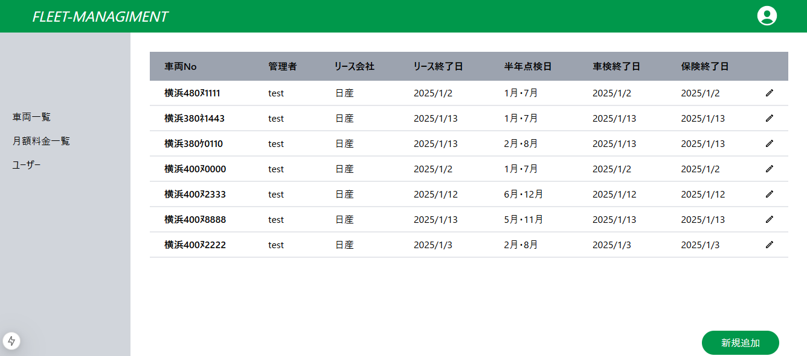
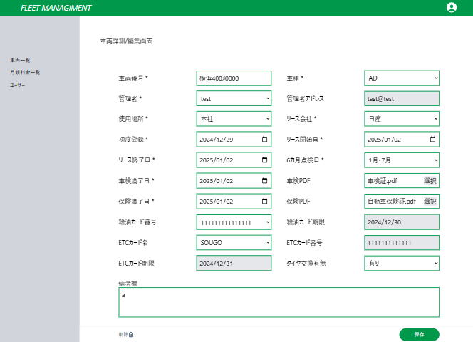
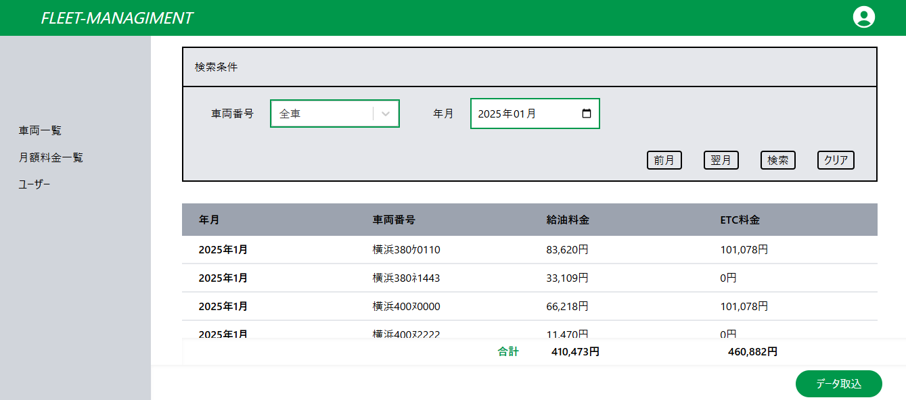
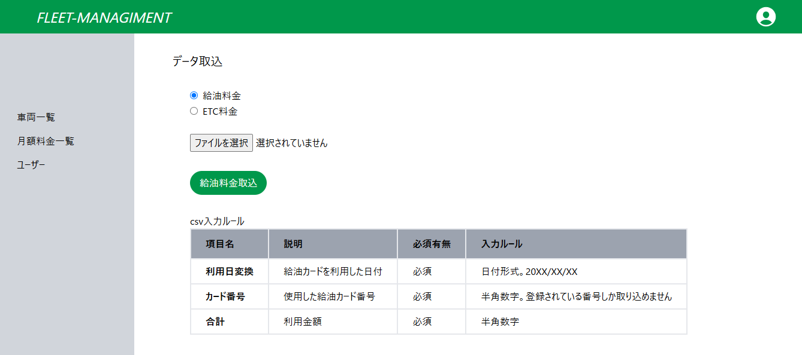
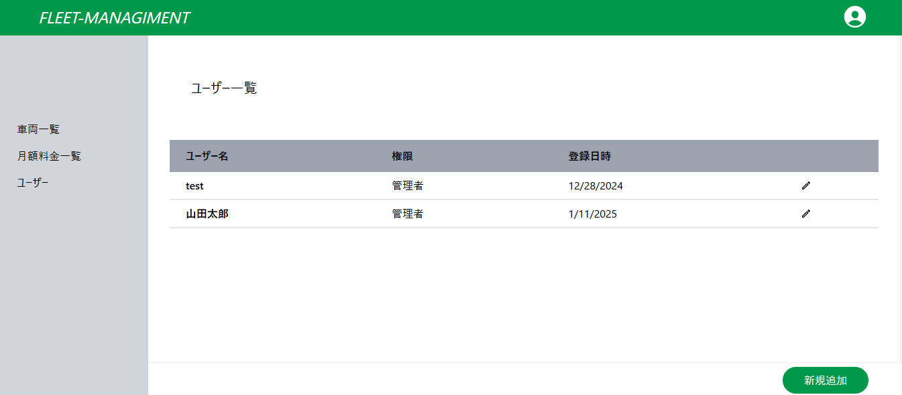
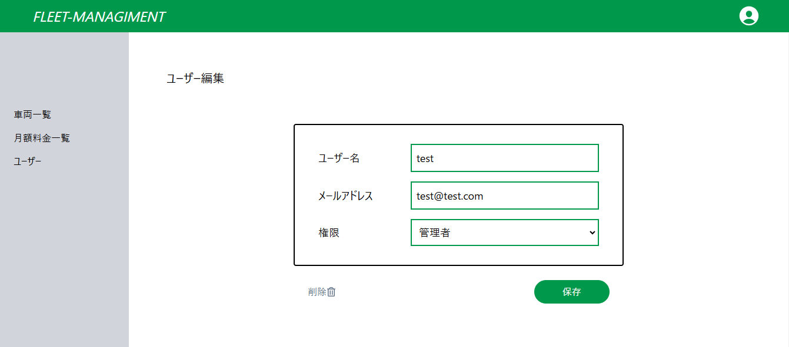

# FLEET MANAGIMENT APP
## 使用技術一覧

 
## 概要
現在勤めている会社の安全運転管理者より、社用車をエクセルの表で管理しているが


- 列が多すぎて表が見づらい
- PDFデータはURLでしか格納できない
- 給油料金やETC料金も管理したい

という意見があったため
社有車を管理できるアプリケーションを作成しました。

## アプリURL
https://fleet-managiment-app-95we.vercel.app/
## テストアカウント
```
Email：test@test.com
Password：testtest
```

## アプリ機能説明
- 認証（ログイン/ログアウト）機能
- 車両情報の登録/閲覧/編集/削除機能
- 給油料金・ETC料金のcsv取り込み、検索機能
- ユーザー登録/閲覧/編集/削除機能

## アプリ表示イメージ
サインイン

車両一覧

車両詳細画面



月額料金一覧

csv取込画面

ユーザー一覧

ユーザー詳細画面


## 今後の実装予定
- 車両の検索機能
- ログインパスワードの再設定機能
- 保険・車検の期限通知機能（車両管理者と安全運転管理者に期限1カ月前にメール通知）
- 給油カードの不正利用検知機能（走行距離と給油量から燃費を算出し、異常値を検出）
- マスタ登録機能

- - -

[業務フロー図](https://www.figma.com/board/KOR6To1DySeUYKabn7P7x9/%E6%A5%AD%E5%8B%99%E3%83%95%E3%83%AD%E3%83%BC%E5%9B%B3?t=GRgdySSlAS6XxdL2-1)

[テーブル定義書/ER図](https://www.figma.com/board/XJSt49AIGBnNwhWf84M3CT/%E8%BB%8A%E4%B8%A1%E7%AE%A1%E7%90%86%E3%82%A2%E3%83%97%E3%83%AA%E3%80%80%E3%83%86%E3%83%BC%E3%83%96%E3%83%AB%E5%AE%9A%E7%BE%A9%E6%9B%B8%2FER%E5%9B%B3?t=ePAML8t0T9fLDlte-6)

[画面遷移図](https://www.figma.com/design/xbBLP1ea5RGyNMGvEmY0xY/%E8%BB%8A%E4%B8%A1%E7%AE%A1%E7%90%86%E3%82%A2%E3%83%97%E3%83%AA%E3%80%80%E7%94%BB%E9%9D%A2%E9%81%B7%E7%A7%BB%E5%9B%B3?m=auto&t=rvQZUkKqtGSIMmQ9-6)
