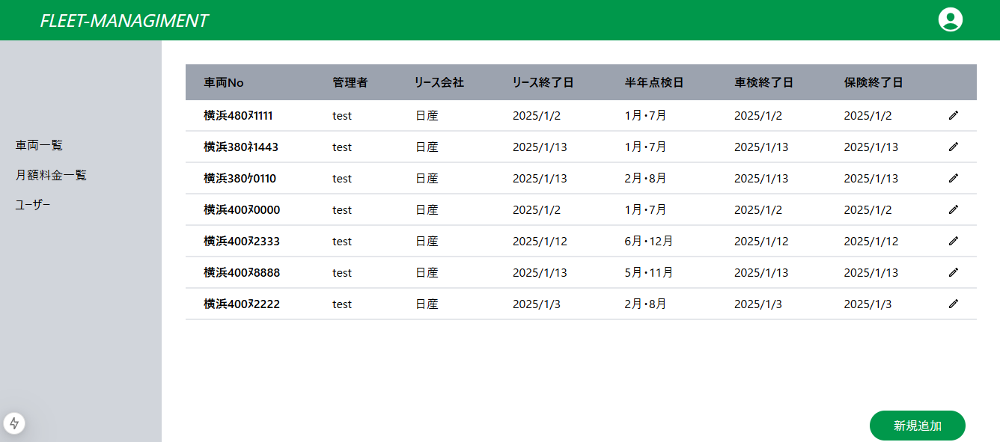
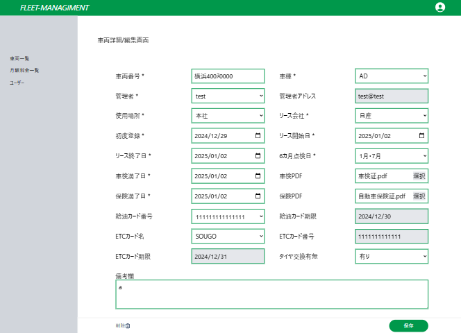
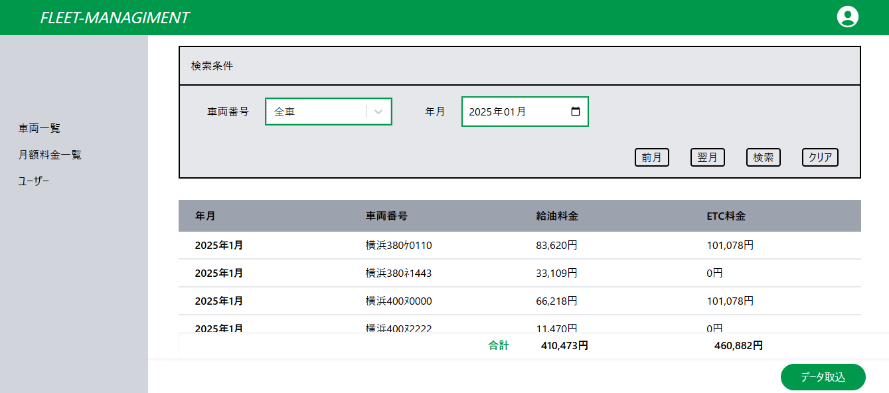
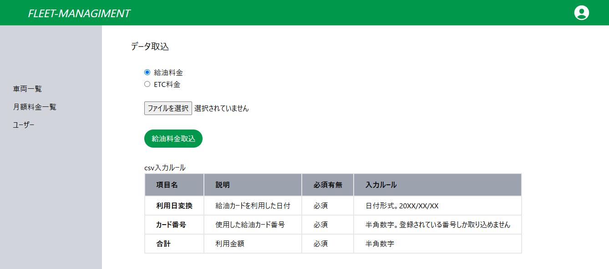
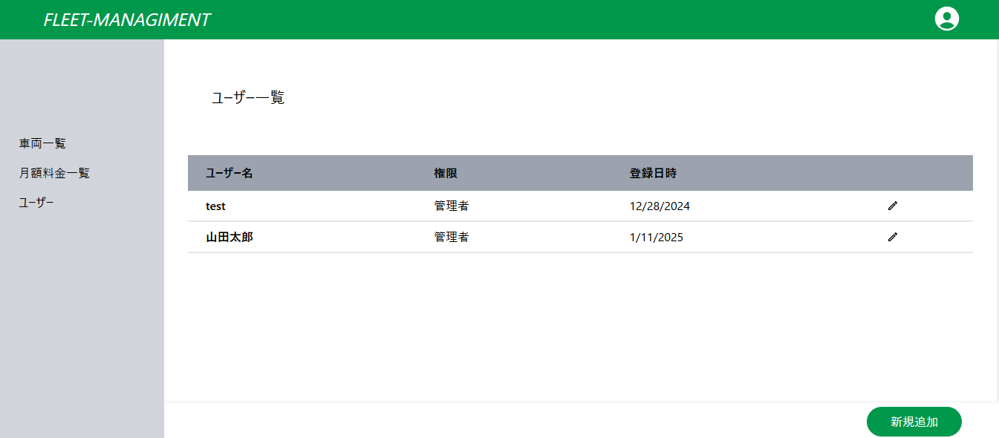
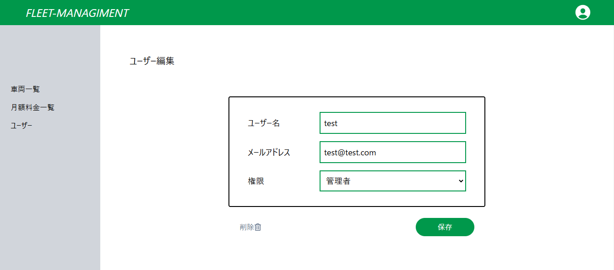

# FLEET MANAGIMENT APP
## 使用技術一覧

 
## 概要
現在勤めている会社の安全運転管理者より、社用車をエクセルの表で管理しているが


- 列が多すぎて表が見づらい
- PDFデータはURLでしか格納できない
- 給油料金やETC料金も管理したい

という意見があったため
社有車を管理できるアプリケーションを作成しました。

## アプリURL
https://fleet-managiment-app-95we.vercel.app/
## テストアカウント
```
Email：test@test.com
Password：testtest
```

## アプリ機能説明
- 認証（ログイン/ログアウト）機能
- 車両情報の登録/閲覧/編集/削除機能
- 給油料金・ETC料金のcsv取り込み、検索機能
- ユーザー登録/閲覧/編集/削除機能

## アプリ表示イメージ
サインイン

車両一覧

車両詳細画面



月額料金一覧

csv取込画面

ユーザー一覧

ユーザー詳細画面


## 今後の実装予定
- 車両の検索機能
- ログインパスワードの再設定機能
- 保険・車検の期限通知機能（車両管理者と安全運転管理者に期限1カ月前にメール通知）
- 給油カードの不正利用検知機能（走行距離と給油量から燃費を算出し、異常値を検出）
- マスタ登録機能

- - -

[業務フロー図](https://www.figma.com/board/KOR6To1DySeUYKabn7P7x9/%E6%A5%AD%E5%8B%99%E3%83%95%E3%83%AD%E3%83%BC%E5%9B%B3?t=GRgdySSlAS6XxdL2-1)

[テーブル定義書/ER図](https://www.figma.com/board/XJSt49AIGBnNwhWf84M3CT/%E8%BB%8A%E4%B8%A1%E7%AE%A1%E7%90%86%E3%82%A2%E3%83%97%E3%83%AA%E3%80%80%E3%83%86%E3%83%BC%E3%83%96%E3%83%AB%E5%AE%9A%E7%BE%A9%E6%9B%B8%2FER%E5%9B%B3?t=ePAML8t0T9fLDlte-6)

[画面遷移図](https://www.figma.com/design/xbBLP1ea5RGyNMGvEmY0xY/%E8%BB%8A%E4%B8%A1%E7%AE%A1%E7%90%86%E3%82%A2%E3%83%97%E3%83%AA%E3%80%80%E7%94%BB%E9%9D%A2%E9%81%B7%E7%A7%BB%E5%9B%B3?m=auto&t=rvQZUkKqtGSIMmQ9-6)


## ディレクトリ構成

```
src/
├── app/                              # ルーティング（Next.js App Router）
│   ├── (dashboard)/                  # ログイン後の画面（レイアウトグループ）
│   │   ├── page.tsx                  # 車両一覧
│   │   ├── carlist/[id]/page.tsx     # 車両詳細
│   │   ├── carlist/create/page.tsx   # 車両新規登録
│   │   ├── feelist/page.tsx          # 料金一覧
│   │   ├── gasmileage/page.tsx       # 燃費一覧
│   │   ├── import/page.tsx           # CSV取込
│   │   └── userlist/page.tsx         # ユーザー一覧
│   ├── api/                          # API ルート
│   │   ├── car/                      # 車両 CRUD
│   │   ├── carlist/                  # 車両一覧（軽量）
│   │   ├── fee/                      # 料金関連
│   │   ├── select/                   # マスタ取得（車種・場所 etc.）
│   │   ├── user/                     # ユーザー CRUD
│   │   └── cron/                     # 定期バッチ（期限通知メール）
│   └── signin/                       # ログイン画面
│
├── components/
│   ├── ui/                           # 汎用UIコンポーネント（ドメイン知識なし）
│   │   ├── Box/                      # セクション囲みボックス
│   │   ├── Button/                   # ボタン
│   │   ├── Input/                    # テキスト入力
│   │   ├── Modal/                    # モーダル基盤
│   │   ├── SearchBar/                # 検索バー
│   │   └── Select/                   # セレクトボックス
│   │
│   ├── features/                     # 機能・ドメイン別コンポーネント
│   │   ├── auth/
│   │   │   └── SignInForm/           # ログインフォーム
│   │   ├── car/
│   │   │   ├── CarDetail/            # 車両詳細・登録・編集フォーム
│   │   │   ├── CarList/              # 車両一覧テーブル
│   │   │   └── Form/                 # フォーム用データ取得（getSelect）
│   │   ├── fee/
│   │   │   ├── FeeList/              # 料金一覧
│   │   │   └── FeeListSearch/        # 料金検索フォーム
│   │   ├── gasmileage/
│   │   │   ├── GasMileageList/       # 燃費一覧
│   │   │   └── GasMileageSearch/     # 燃費検索フォーム
│   │   ├── import/
│   │   │   └── Import/               # CSV取込（車種・場所・ETC etc.）
│   │   └── user/
│   │       ├── UserDetail/           # ユーザー詳細・編集フォーム
│   │       ├── UserList/             # ユーザー一覧テーブル
│   │       ├── UserModal/            # ユーザー登録モーダル
│   │       └── UserSetting/          # ユーザー設定
│   │
│   └── layout/                       # レイアウト用コンポーネント
│       ├── Header/                   # ヘッダー
│       └── Sidebar/                  # サイドバー
│
├── context/
│   └── authContext.tsx               # Firebase 認証状態の管理
│
├── lib/                              # 外部サービス・共通ユーティリティ
│   ├── prisma.ts                     # Prisma クライアント（シングルトン）
│   ├── firebase.ts                   # Firebase クライアント初期化
│   ├── adminFirebase.ts              # Firebase Admin SDK
│   ├── sendmail/                     # メール送信（車検・保険期限通知）
│   └── supabase/                     # Supabase（PDF ストレージ）
│
└── types/                            # 型定義
    ├── Car.ts                        # 車両マスタ関連
    ├── CarData.ts                    # 車両詳細データ
    ├── CarForm.ts                    # 車両フォーム
    ├── CarListData.ts                # 車両一覧データ
    ├── CarSelect.ts                  # 車両セレクト用
    ├── FeeData.ts                    # 料金データ
    ├── GasMileageData.ts             # 燃費データ
    ├── Select.ts                     # 汎用セレクト
    └── UserData.ts                   # ユーザーデータ
```

### 設計方針

| ディレクトリ | 役割 |
|---|---|
| `components/ui/` | ドメイン知識を持たない汎用 UI。どの画面でも再利用可能 |
| `components/features/` | ビジネスロジックを含む機能単位のコンポーネント。ドメインごとに分類 |
| `components/layout/` | ページ全体のレイアウトを構成するコンポーネント |
| `lib/` | DB・外部サービスへのアクセス処理。コンポーネントから分離 |
| `types/` | 型定義の一元管理 |
